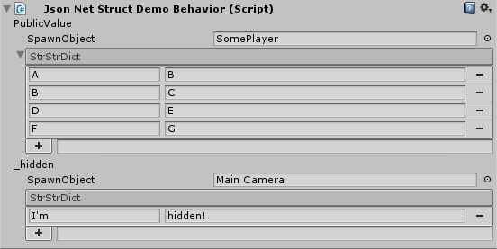
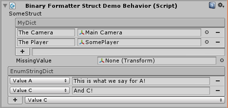

# Usage

## Working Guide

<hr />

```c#
using FullInspector;

public class HelloFullInspector : BaseBehavior {
    public Dictionary<string, GameObject> dict;
}
```

<hr />

The easiest way to use Full Inspector is to derive from either `BaseBehavior` or `BaseScriptableObject`. Full Inspector will then just work. If you override `Awake`, make sure you call `base.Awake()`.

That’s it! Of course, you’ll also have to added your serialization specific annotations if your serializer requires them. If that sounds confusing, then don’t worry. There are examples below that demonstrate this point.

<note>
If deriving from a custom base class is not an option or you wish to limit how Full Inspector interacts with your project, then you can use [fiValue](#docs/fivalue).
</note>

<important>
One potential gotcha with serialization: each `BaseBehavior` field/property is serialized independently. If you have a class instance that is shared across multiple `BaseBehaviors` or multiple fields/properties, it will be deserialized into separate instances. You can ensure that it deserializes into one instance by deriving from a `UnityEngine.Object` child class, such as `BaseScriptableObject` or `SharedInstance<T>`.
</important>

<important>
If you're modifying `BaseBehavior` object instances that are not being inspected, then everything will usually work *unless* the object is a prefab. If it's a prefab, then you need to call `obj.SaveState()` after you're done editing it so that the changes will be serialized. 
<br /> <br />
It's perfectly fine to call `obj.SaveState()` if the object is not a prefab. However, you do not need to as Full Inspector makes this call automatically for you so that you don't have to worry about it.
</important>

When you first install Full Inspector you'll see the [serializer manager](#docs/usage_serializer_manager) popup which will let you pick the default serializer. Full Serializer is recommended for default usage; it works well without annotations and supports every major Unity platform.

Best of all, with Full Serializer you don't need to learn any new serialization annotations - it will work just like Unity, except that everything can now be serialized.

[How do I change my default serializer?](#docs/usage_serializer_manager)

If you need performance, you can easily switch to protobuf-net for one specific component while using Full Serializer for ease of use on the rest of your behaviors. Everything interacts correctly, even when using different serializers.

## Examples

Here’s an example of the simplicity of Full Serializer:

```c#
public struct Simple<T> {
    public T Value { get; set; }
}

public class FullDemo : BaseBehavior<FullSerializerSerializer> {
    public Simple<int> SimpleInt;
    public Simple<float> SimpleFloat;
}
```


Here’s an example of how to use Full Inspector with Json.NET:

```c#
public struct Struct {
    public GameObject SpawnObject;
    public Dictionary<string, string> StrStrDict;
}

public class JsonNetStructDemoBehavior :
    BaseBehavior<JsonNetSerializer> {

    public Struct PublicValue;

    [ShowInInspector]
    private Struct _hidden; /* this field is not serialized */
}
```



If you like annotations, you could have optionally written Struct as

```c#
[JsonObject]
public struct Struct {
    [JsonProperty]
    public GameObject SpawnObject;
    [JsonProperty]
    public Dictionary<string, string> StrStrDict;
}
```

Or perhaps you prefer protobuf-net?

```c#
[ProtoContract]
[ProtoInclude(1, typeof(Implementation1))]
[ProtoInclude(2, typeof(Implementation2))]
public interface IInterface {
}

[ProtoContract]
public class Implementation1 : IInterface {
    [ProtoMember(1)]
    public int A;
}

[ProtoContract]
public class Implementation2 : IInterface {
    [ProtoMember(1)]
    public bool B;

    [ProtoMember(2)]
    public Transform Location;
}

public class InterfaceDemoBehavior :
    BaseBehavior<ProtoBufNetSerializer> {

    public IInterface MyInterface;
}
```


<important>
There is experimental support for protobuf-net on AOT platforms such as iOS. Please use “Window/Full Inspector/Developer/Create protobuf-net precompiled serializer” before deploying to those targets.

The precompiled serializer requires an explicit installation of mono on OSX (due to Unity build system limitations, the protobuf-net DLL has to be decompiled into C#, and FI includes a tool to do such, but it is written in C# and requires .NET 4 and so cannot be run in the Unity runtime environment).
</important>

Or maybe even BinaryFormatter (not recommended)?

```c#
[Serializable]
public struct Struct<TValue> {
    public Dictionary<string, TValue> MyDict;
    public TValue MissingValue;
}

public class BinaryFormatterStructDemoBehavior :
    BaseBehavior<BinaryFormatterSerializer> {

    public Struct<Transform> SomeStruct;

    public enum Enum {
        ValueA, ValueB, ValueC
    }
    public Dictionary<Enum, string> EnumStringDict;
}
```

